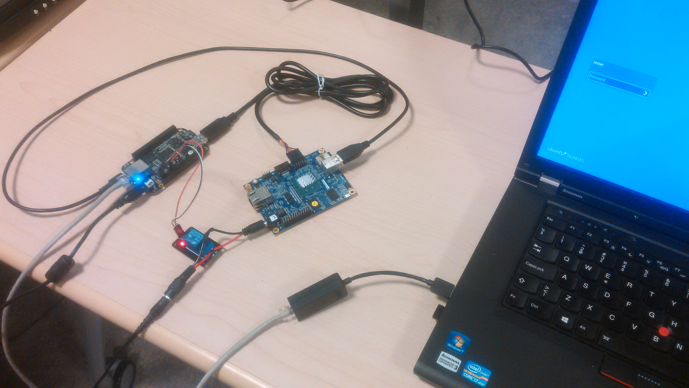
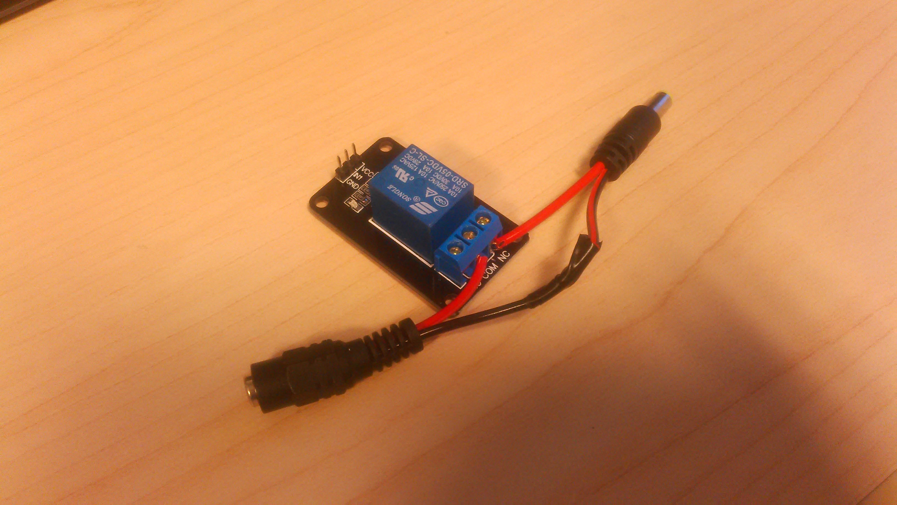
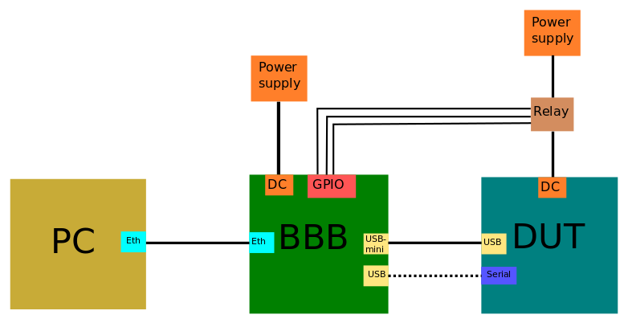
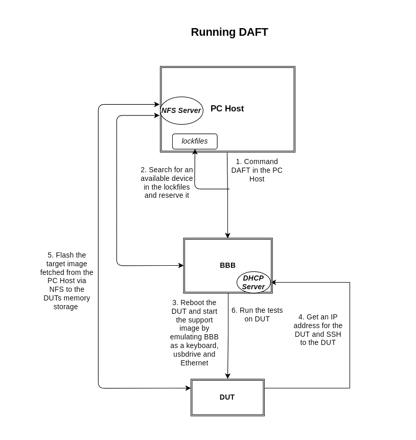
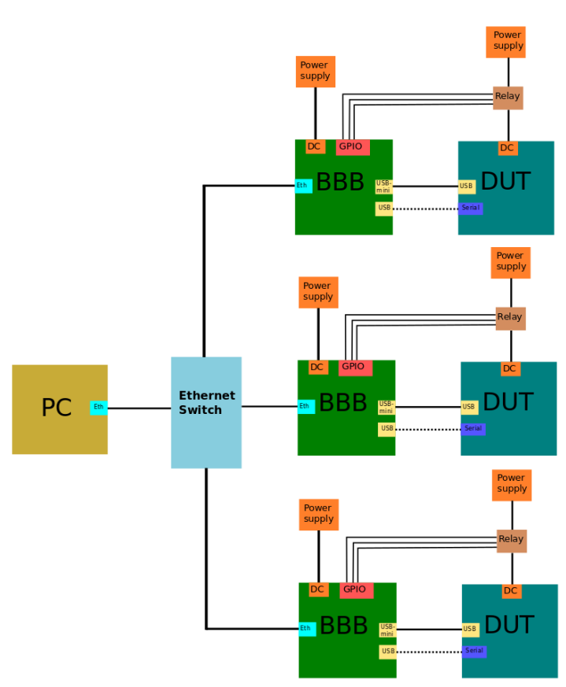
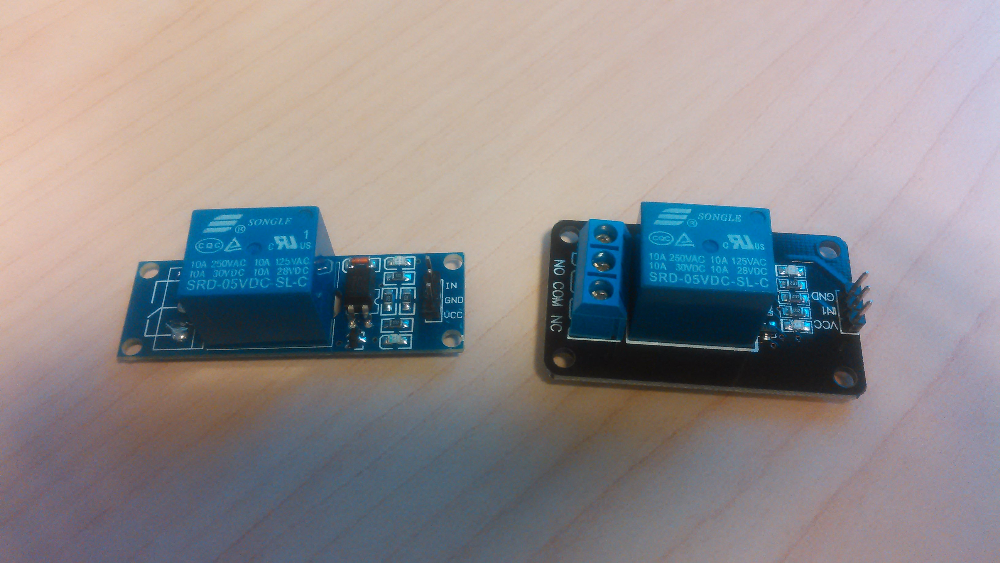

# Distributed Automatic Flasher Tester (DAFT)

# Contents

1. [Overview](#1-overview)
    * 1.1. [DAFT setup](#11-daft-setup)
    * 1.2. [How it works](#12-how-it-works)
2. [Creating DAFT setup](#2-creating-daft-setup)
    * 2.1 [Required hardware](#21-required-hardware)
    * 2.2 [BBB booting overview](#22-bbb-booting-overview)
    * 2.3 [Setting up BeagleBone Black filesystem on the host PC](#23-setting-up-beaglebone-black-filesystem-on-the-host-pc)
    * 2.4 [Configuring host PC](#24-configuring-host-pc)
        * 2.4.1 [Secondary network interface](#241-secondary-network-interface)
        * 2.4.2 [DHCP server](#242-dhcp-server)
        * 2.4.3 [TFTP server](#243-tftp-server)
        * 2.4.4 [NFS server](#244-nfs-server)
        * 2.4.5 [Changing BBB filesystem permissions](#245-changing-bbb-filesystem-permissions)
        * 2.4.6 [Changing NFS workspace that BBB and DUT support image will mount](#246-changing-nfs-workspace-that-bbb-and-dut-support-image-will-mount)
        * 2.4.7 [Install and configure DAFT software](#247-install-and-configure-daft-software)
    * 2.5 [Setting BeagleBone Black to boot from NFS](#25-setting-beaglebone-black-to-boot-from-nfs)
    * 2.6 [Setting up relay](#26-setting-up-relay)
    * 2.7 [Connecting hardware](#27-connecting-hardware)
    * 2.8 [Setting up DUT](#28-setting-up-dut)
    * 2.9 [Using DAFT](#29-using-daft)
    * 2.10 [Adding more devices](#210-adding-more-devices)
3. [DAFT and AFT settings and commandline interface](#3-daft-and-aft-settings-and-commandline-interface)
    * 3.1 [DAFT settings](#31-daft-settings)
    * 3.2 [DAFT commandline interface](#32-daft-commandline-interface)
    * 3.3 [AFT settings](#33-aft-settings)
    * 3.4 [AFT commandline interface](#34-aft-commandline-interface)
    * 3.5 [Detailed DAFT run](#35-detailed-daft-run)
4. [Creating BeagleBone Black filesystem](#4-creating-beaglebone-black-filesystem)
5. [Creating support image for DUT](#5-creating-support-image-for-dut)
    * 5.1 [Ubuntu for PC like devices](#51-ubuntu-for-pc-like-devices)
6. [Troubleshooting](#6-troubleshooting)
    * 6.1 [PC to BBB serial connection](#61-pc-to-bbb-serial-connection)
    * 6.2 [Beaglebone Black booting](#62-beaglebone-black-booting)
    * 6.3 [DHCP problems](#63-dhcp-problems)
    * 6.4 [TFTP problems](#64-tftp-problems)
    * 6.5 [NFS problems](#65-nfs-problems)

[DAFT hardware images](#daft-hardware-images)

# 1. Overview


_DAFT hardware setup._

DAFT (Distributed Automatic Flasher Tester) is a tool for automated flashing and
testing of an OS image on a real device. Its goal is to both standardize and
simplify the testing on a variety of devices, while keeping minimal the cost and
the complexity of the setup. In particular, it strives to use only inexpensive
off-the shelf hardware components and to keep one single configuration that can
be used by both large testing farms and individual testers/developers. This guide explains how to setup and use DAFT. Note that this guide was written for Ubuntu so you might have to do additional steps in other distributions.

## 1.1 DAFT setup

DAFT setup consists of a PC, Beaglebone black(s) (BBB) and device(s) under test
(DUT). Role of the BBB is to control the DUT so flashing and testing can be done.
Every DUT in the setup needs one BBB to control it. BBB has the ability to emulate
keyboard, mass storage and ethernet device at the same time through one USB OTG
port. It also has different kinds of input/output pins like GPIO and I2C which
enables lots of possibilities with testing. For example at the time of writing
GPIO pins are used to control a relay that is used to turn the DUT on/off. Role
of the PC is to control the BBBs and to provide them the image to be flashed and
tested. PC also provides BBBs the filesystem that they boot from using NFS and
TFTP.

DAFT is also split code wise with _testing_harness_ including the code BBB uses
and _pc_host_ including the code the PC uses. The program that BBB uses is
called AFT (Automatic Flasher Tester) and the program that the PC uses is DAFT.


## 1.2 How it works

At the highest level DAFT is called from the command line with the device type
and the image file to be tested as its arguments:
```
daft joule os-image.img
```

DAFT will then procede to flash the image to the device. After that has been
done successfully the new image is booted and tests are executed. Tests aren't
strictly part of DAFT but rather DAFT includes tools and libraries to interact
with the device so own test can be written or existing test suites can be
integrated.


# 2. Creating DAFT setup

Fewest mandatory steps to create DAFT setup with one device under test (DUT) and
BeagleBone Black (BBB):

* [Get required hardware](#21-required-hardware)
* [BBB booting overview](#22-bbb-booting-overview)
* [Set up BeagleBone Black filesystem on the PC](#23-setting-up-beaglebone-black-filesystem-on-the-host-pc)
* [Configure host PC](#24-configuring-host-pc)
* [Set BeagleBone Black to boot from NFS](#25-setting-beaglebone-black-to-boot-from-nfs)
* [Set up relay](#26-setting-up-relay)
* [Connect hardware together](#27-connecting-hardware)
* [Set up DUT](#28-setting-up-dut)
* [Use DAFT](#29-using-daft)

When the setup has been completed check the section on
[adding more devices](#210-adding-more-devices).

## 2.1 Required hardware


_1. USB to USB-mini cable 2. BeagleBone Black 3. Micro SD card 4. USB-Serial cable
5. Ethernet cable 6. BBB power supply 7. DUT power supply 8. Power jack extension
cable 9. Relay 10. Dupont cables 11. DUT (Minnowboard MAX) 12. Micro SD card
13. Secondary network interface 14. Ubuntu PC_

List of hardware needed for DAFT setup:

* PC preferably with Ubuntu
    * Other distros should work also but this guide is written using Ubuntu
* Secondary network interface for PC if it doesn't have one
    * Easiest option is USB ethernet adapter, cheapest is PCI network card
* BeagleBone Black
* Micro SD card for [BBB U-Boot](#25-setting-beaglebone-black-to-boot-from-nfs)
  (optional)
* Ethernet cable
* USB to USB-mini cable
    * BeagleBone Black should come with one
* [USB-serial cable](#usb-serial) (recommended)
    * Used for debugging BBB/DUT or for recording serial data from DUT
* Device to test with: Joule or Minnowboard MAX/Turbot
* If DUT is Minnowboard (it has no internal storage), micro SD card or USB stick
  is required so testable image can be flashed to it
* Power supplies for BBB and DUT
* [GPIO controllable relay](#relays)
    * BBB GPIO pin output is 3.3V and max 6mA, VDD pins are 5V/3.3V 250mA, so
      relay has to be operable within those limits
    * Relay with and amplifier in the input would be preferred so BBB GPIO pin
      doesn't have to drive the coil
* 3x Dupont cables to connect relay to BBB
* DC plug extension cable (recommended)
    * [So you don't have to cut power supply cable](#26-setting-up-relay)
    * Flat extension cables that have easily separable ground and DC cables are
      recommended

At the time of writing only Joule and Minnowboard MAX/Turbot are supported as DUT
but any PC like device with BIOS should work with small tweaks. Older version of
the setup was also tested to work with Gigabyte NUC, Intel Edison, BeagleBone
Black and Intel Galileo V2 but they might require some work on the BeagleBone
filesystem to make them work.

## 2.2 BBB booting overview

This section will give you an overview of the BBB booting components, boot sequence and how it relates to the PC Host. This should give you a good understanding of why we need to setup various different services and what is their role.


_BeagleBone Black booting with the PC Host._

The above diagram shows the general steps when setting up the BBB and booting it:
1. Connect the PC Host to the BBB via serial.
2. Get an IP adress for the BBB from the DHCP server.
3. Get the BBB bootsystem kernel via TFTP. The BBB will fetch the bootsystem kernel from the PC Host via TFTP.
4. BBB executes the kernel, which is the bootsystem core and is needed to be able to boot the rest of the system via NFS.
5. Boot the rest of the system via NFS.


## 2.3 Setting up BeagleBone Black filesystem on the host PC

Make [BBB filesystem](#4-creating-beaglebone-black-filesystem) and
[support image](#5-creating-support-image-for-dut) for DUT from scratch or
download already made one. To download ready made BBB filesystem and extract it
to root use these commands:
```
cd /
sudo wget address-to-bbb-fs
sudo tar -xzf bbb_nfs.tar.gz
```

## 2.4 Configuring host PC

Service wise there is different ways to do everything but the end goal is
to have static IP address on the secondary network interface (_192.168.30.1_)
and to have DHCP, TFTP and NFS server running on that network. It is very important that you are careful especially with the DHCP server so that you don't accidentally configure it to the wrong interface (you should never configure the DHCP server to the interface from which your PC Host gets its internet, unless you know exactly what you are doing. This guide has
been written using Ubuntu so on different distro you might have to do things
differently.

### 2.4.1 Secondary network interface

Configure the secondary network interface to have static _192.168.30.1_ IP
address. Use `ifconfig` to determine which one is the secondary network interface.
If you have desktop Ubuntu you can use the graphical Network Manager to change the
IP address: `edit -> IPv4 Settings`, change _Method_ to _Manual_, _Address_ to
_192.168.30.1_ and _Netmask_ to _255.255.255.0_. Other way is to use terminal:
remove all the settings in `/etc/network/interfaces` for the interface and add
following lines to it (change **eth1** to previously determined one):
```Bash
sudo vim /etc/network/interfaces
```
<pre>
auto <b>eth1</b>
iface <b>eth1</b> inet static
   address 192.168.30.1
   netmask 255.255.255.0
   network 192.168.0.0
</pre>

Restart the network interface (change **eth1** to previously determined one):
<pre>
sudo ifdown <b>eth1</b> && sudo ifup <b>eth1</b>
</pre>

### 2.4.2 DHCP server

A service called <b>dnsmasq</b> has the required dhcp server so first install dnsmasq:
```
sudo apt install dnsmasq
```

Configure dnsmasq by adding `interface=eth1` and
`dhcp-range=192.168.30.2,192.168.30.254,10m `lines to `/etc/dnsmasq.conf`
(again instead of <b>eth1</b> use your secondary network interface name):
<pre>
sudo sh -c 'echo "interface=<b>eth1</b>" >> /etc/dnsmasq.conf'
sudo sh -c 'echo "dhcp-range=192.168.30.2,192.168.30.254,10m" >> /etc/dnsmasq.conf'
</pre>

Restart and enable dnsmasq so it automatically starts after reboot:
```
sudo systemctl restart dnsmasq; sudo systemctl enable dnsmasq
```
Refer to [DHCP problems](#63-dhcp-problems) if you are having issues with this.

### 2.4.3 TFTP server

First install required packages:
```
sudo apt install xinetd tftpd tftp
```

Create a new file `/etc/xinetd.d/tftp` and add TFTP configuration:
```
sudo vim /etc/xinetd.d/tftp
```
```
service tftp
{
protocol        = udp
port            = 69
socket_type     = dgram
wait            = yes
user            = nobody
server          = /usr/sbin/in.tftpd
server_args     = /daft
disable         = no
}
```

Restart and enable xinetd service:
```
sudo systemctl restart xinetd; sudo systemctl enable xinetd
```
Note here that not all distros have xinetd service. In that case you might have to install something else. Refer to [TFTP problems](#64-tftp-problems) if there are problems.
### 2.4.4 NFS server

First install nfs-kernel-server:
```
sudo apt install nfs-kernel-server
```

Choose a user that DAFT will be used with and find it's ID (**uid**) and group ID
numbers (**gid**):
```
id <user>
```

Choose a workspace directory that BBB will use to get the image to flash and write
logs to. DAFT can only be used inside it and its directories. It could be your
users home directory or some other one which the user has write permission. Add
following lines to `/etc/exports` but change **/your/workspace** and values of
_anonuid_ and _anongid_ to match your workspace and user choices:
```
sudo vim /etc/exports
```
<pre>
<b>/your/workspace</b> 192.168.30.0/24(crossmnt,rw,root_squash,anonuid=<b>1001</b>,anongid=<b>100</b>,sync,no_subtree_check)
/daft/support_img 192.168.30.0/24(crossmnt,rw,root_squash,anonuid=<b>1001</b>,anongid=<b>100</b>,sync,no_subtree_check)
/daft/bbb_fs 192.168.30.0/24(crossmnt,ro,root_squash,anonuid=<b>1001</b>,anongid=<b>100</b>,sync,no_subtree_check)
</pre>

Put changes in effect and restart and enable nfs-kernel-server:
```
sudo exportfs -ra
sudo systemctl restart nfs-kernel-server; sudo systemctl enable nfs-kernel-server
```
Refer to [NFS problems](#65-nfs-problems) if you have issues with NFS.

### 2.4.5 Changing BBB filesystem permissions

Previously on the [NFS chapter](#244-nfs-server) we chose a user that DAFT will be
used with. We will need to change the owner of `/daft/bbb_fs` and
`/daft/support_img` to that user and users group. It's done with:
<pre>
sudo chown -R <b>user</b>:<b>group</b> /daft/*
sudo chown root:root /daft/bbb_fs/root/.ssh/config
</pre>

### 2.4.6 Changing NFS workspace that BBB and DUT support image will mount

On the [NFS chapter](#244-nfs-server) we chose a workspace for BBB to use. We need
to change **/home/tester** in `/daft/bbb_fs/etc/fstab` to that one:
```
sudo vim /daft/bbb_fs/etc/fstab
```
<pre>
192.168.30.1:<b>/home/tester/</b> /root/workspace nfs rsize=8192,wsize=8192,timeo=14,intr,nolock,auto
</pre>

Then change DUT support image to also use it. Use `fdisk` to check partitions
and use the values from it for the `mount` offset value (multiply unit size
and end block eg. 512*1050624):
```
sudo fdisk -l /daft/support_img/support.img
```
<pre>
Disk support.img: 7,2 GiB, 7746879488 bytes, 15130624 sectors
Units: sectors of 1 * 512 = <b>512 bytes</b>
Sector size (logical/physical): 512 bytes / 512 bytes
I/O size (minimum/optimal): 512 bytes / 512 bytes
Disklabel type: gpt
Disk identifier: 891A46A3-0ACF-42D6-8009-9024012A0EAD

Device                 Start     End Sectors  Size Type
working_support.img1    2048 1050623 1048576  512M EFI System
working_support.img2 <b>1050624</b> 6983679 5933056  2,8G Linux filesystem
</pre>
<pre>
sudo mkdir /tmp_daft
sudo mount -o loop,offset=<b>537919488</b> /daft/support_img/support.img /tmp_daft
sudo vim /tmp_daft/etc/fstab
</pre>
<pre>
192.168.30.1:<b>/home/tester/</b> /mnt/img_data_nfs nfs rsize=8192,wsize=8192,timeo=14,intr,nolock,auto
</pre>

Unmount the image and remove the temporary folder:
<pre>
sudo umount /tmp_daft; sudo rmdir /tmp_daft
</pre>

## 2.4.7 Install and configure DAFT software

Clone DAFT github repository:
```
cd; git clone https://github.com/01org/DAFT.git
```

Install Python3 setuptools and the server side software:
```
sudo apt install python3-setuptools
cd DAFT/pc_host; sudo python3 setup.py install
```

Change DAFT configuration file to use your [previously chosen](#244-nfs-server)
workspace directory instead of **/home/tester/**:
<pre>
sudo vim /etc/daft/daft.cfg
</pre>
<pre>
[daft]
workspace_nfs_path = <b>/home/tester/</b>
bbb_fs_path = /daft/bbb_fs/
</pre>

Now you can update both DAFT on the PC and AFT on the BBB filesystem with:
```
cd ~/DAFT; sudo daft --update
```

Finally change `/etc/daft/lockfiles` owner to your DAFT user:
<pre>
sudo chown <b>user</b>:<b>group</b> /etc/daft/lockfiles
</pre>

## 2.5 Setting BeagleBone Black to boot from NFS

Setting BBB to boot from NFS is done by changing `/uEnv.txt` file contents on a
BBB image (this means the uEnv.txt file in the BBB itself and not in the NFS files) to this:
```
bootcmd=setenv autoload no; dhcp; setenv bootargs console=ttyO0,115200n8, root=/dev/nfs nfsroot=${serverip}:/daft/bbb_fs,vers=3 ro ip=${ipaddr}; tftp 0x81000000 bbb_fs/boot/vmlinuz-4.4.9-ti-r25; tftp 0x80000000 bbb_fs/boot/dtbs/4.4.9-ti-r25/am335x-boneblack.dtb; bootz 0x81000000 - 0x80000000
uenvcmd=boot
```

You can use the default factory image inside the BBB or flash a working BBB image
with U-Boot to SD card. If you want to use the image inside BBB just boot it and
use [USB-serial cable](#usb-serial), SSH or monitor and keyboard to change the
file. For problems with USB-serial booting refer to [PC to BBB serial connection](#61-pc-to-bbb-serial-connection)

If you want to use SD card you have to first boot BBB with the factory image and
use following command on it to destroy its U-Boot files so it won't boot from
those:
```
dd if=/dev/zero of=/dev/mmcblk0 bs=4M count=10; sync
```

Working BBB image can be downloaded from
[here](https://beagleboard.org/latest-images). To flash the image to the SD card
first connect the SD card to the PC and check `lsblk` and/or `dmesg` to see the
path to the SD card. Flashing the downloaded file to SD card can be done with
these commands (change **bone-debian** to match the downloaded image and sd**X**
to match your SD card path):
<pre>
cd ~/Downloads
unxz <b>bone-debian</b>.img.xz
sudo dd if=<b>bone-debian</b>.img of=/dev/sd<b>X</b> bs=8M status=progress
</pre>

## 2.6 Setting up relay


_Relay with extension cable hooked up._

First cut the DC plug extension cable in half from the middle (or power supplys
one if you don't mind cutting it). At least some cables had trouble if they
weren't cut short so it's recommended to shorten the cables first. Then solder
the ground lines back together and use tape or heat shrink tube to cover it.
Then solder or screw the DC line cables to the relay. If the relay has screw
holes it's recommended to solder small tin beads to the cable ends and flatten
them with pliers to get better contact. On default it's expected that the relay
is normally closed (DUT is powered on) but this can be changed by changing
_gpio_cutter_on_ and _gpio_cutter_off_ values:
<pre>
sudo vim /daft/bbb_fs/etc/aft/devices/platform.cfg
</pre>
<pre>
[PC]
leases_file_name = /var/lib/misc/dnsmasq.leases
keyboard_emulator = GadgetKeyboard
cutter_type = GpioCutter
gpio_pin = gpio60
gpio_cutter_on = <b>1</b>
gpio_cutter_off = <b>0</b>
pem_port = /dev/hidg0
serial_bauds = 115200
</pre>

## 2.7 Connecting hardware



_Wiring diagram for hardware._


_How to connect the relay to the BBB._

After everything else has been done, hardware can be connected together according
to the pictures above and BBB can be booted from NFS. If there is a problem with
booting it's most likely due to dnsmasq, TFTP, NFS or file permissions. Check
[troubleshooting section](#5-troubleshooting) for more help if needed.

## 2.8 Setting up DUT

On default it's expected that the DUT has specific boot order set in BIOS so with
keyboard emulation we can choose the right device to boot from. The first boot
option should be the device that the image is going to be flashed to eg. SD card
or USB stick. Minnowboard MAX/Turbot should have the BBB USB stick emulation as
the last option and Joule should have it as second option (BIOS in Joule seemed to
reset the order this way so it should be the most stable option). Use USB-serial
cable or keyboard and monitor to change BIOS settings. Other option is to change
the keyboard sequence that boots from the BBB USB stick emulation:
```
sudo vim /daft/bbb_fs/root/kbsequences/joule/boot_usb
sudo vim /daft/bbb_fs/root/kbsequences/minnowboard/boot_usb
```

Or you can create new keyboard sequence files and change AFT settings for BBB:
<pre>
sudo vim /daft/bbb_fs/etc/aft/devices/catalog.cfg
</pre>
<pre>
[Joule]
platform = PC
test_plan = iot_qatest
target_device = /dev/mmcblk0
root_partition = /dev/mmcblk0p3
service_mode = Ubuntu
boot_usb_keystrokes = <b>/root/kbsequences/joule/boot_usb</b>
boot_internal_keystrokes = <b>/root/kbsequences/empty</b>
serial_port = /dev/ttyUSB0

[Minnowboard]
platform = PC
serial_port = /dev/ttyUSB0
test_plan = iot_qatest
target_device = /dev/mmcblk0
root_partition = /dev/mmcblk0p3
service_mode = Ubuntu
boot_usb_keystrokes = <b>/root/kbsequences/minnowboard/boot_usb</b>
boot_internal_keystrokes = <b>/root/kbsequences/empty</b>
</pre>

## 2.9 Using DAFT


After BBB has been booted successfully check _dnsmasq.leases_ file to see BBB IP
address:
```
cat /var/lib/misc/dnsmasq.leases
```
In some distros the location of this file might be different. In that case you can use `arp -n` in the terminal to do the same thing.

<pre>
1481817223 b0:d5:cc:f4:8c:41 <b>192.168.30.61</b> DAFT_BBB *
</pre>

Copy that IP address to `/etc/daft/devices.cfg`:
```
sudo vim /etc/daft/devices.cfg
```
<pre>
[Minnowboard1]
bb_ip = <b>192.168.30.2</b>

[Joule1]
bb_ip = <b>192.168.30.3</b>
</pre>

Now everything should be set to use daft. Basic DAFT command that flashes and
tests an image:
```
daft minnowboard yocto-image.dsk
```

Flash and test an image while recording serial output:
```
daft minnowboard yocto-image.dsk --record
```


Next, we'll take a look at what happens when we run DAFT. This is a high level overview. For more detailed DAFT run refer to [Detailed DAFT run](#35-detailed-daft-run)



_Running daft._

1. Start daft by executing the following command in the PC Host: `daft DUT PATH/TO/IMG.img`. Replace DUT with the desired DUT e.g. `minnowboard` or `joule` and `PATH/TO/IMG.img` with the image you want to flash. You can also run the command directly in BBB but then it won't lock the DUTs. Running daft in BBB is done with the command `aft DUT PATH/TO/IMG.img`. In case you want to only flash or test or boot the DUT refer to [DAFT commandline interface](#32-daft-commandline-interface) to add correct options for DAFT.
2. DAFT then checks if the device is blacklisted or locked in the lockfiles. If not, then it locks it so other simultaneous DAFT runs won't use the same DUT. Or if you call DAFT explicitly e.g. `daft joule1`, it will only look for that device.
3. BBB reboots the DUT and proceeds to start the support image in the DUT. The support image is needed so that the target image can be flashed to the SD card or to another memory storage. BBB emulates itself as multiple components to enable automated and simple function:
   1. As a keyboard (to get through DUT BIOS and to select the correct device to boot from).
   2. As a USB drive (so that the DUT can boot the support image).
   3. As an ethernet interface (ethernet is needed so the BBB can connect to the DUT and run commands on it required when flashing or testing).
4. When the support image boots, it gets an IP address from the BBBs DHCP server (NOT THE PC HOSTS). If you want to, you can SSH to the DUT from the PC Host by first doing a SSH to the BBB and then another SSH to the DUT.
5. Flash the target image fetched from the PC Host via NFS to the DUTs memory storage. The DUT doesn't connect directly to the PC Host but instead through the BBB, which forwards the connection both ways.
6. Boot the flashed image and run the tests on DUT.


For more info about using DAFT and its settings check
[DAFT and AFT settings and commandline interface](#3-daft-and-aft-settings-and-commandline-interface)
section. If flashing fails DAFT will blacklist the BBB
used by locking the device until `/etc/daft/lockfiles/<device>` is emptied or
removed.

## 2.10 Adding more devices



_Setup with three DUTs._

To add more DUTs and BBBs to the setup an ethernet switch is needed between the
PC and BBBs. Nothing else special is needed. Just configure new BBBs to boot
from the same NFS directory as previously and check `/var/lib/misc/dnsmasq.leases`
file after they have booted for their IP address. Then add new devices to
`/etc/daft/devices.cfg` with different number:
```
vim /etc/daft/devices.cfg
```
<pre>
[Minnowboard1]
bb_ip = 192.168.30.2

<b>[Minnowboard2]
bb_ip = 192.168.30.4</b>

[Joule1]
bb_ip = 192.168.30.3

<b>[Joule2]
bb_ip = 192.168.30.5</b>
</pre>

After these are configured, you call them the same way you'd call a single device. DAFT automatically checks which devices are in use and which are not by locking and unlocking them in
```
/etc/daft/lockfiles/
```
So you don't have to call the DUTs explicitly `daft minnowboard1 PATH/TO/DUT.img` but instead you can just call `daft minnowboard PATH/TO/DUT.img`.


## 3. DAFT and AFT settings and commandline interface

This section includes information about DAFT and AFT config files, CLI and also an example DAFT run where all the steps that DAFT takes are explained.


### 3.1 DAFT settings

DAFT settings are located in `/etc/daft/daft.cfg` and on default are:
```
[daft]
workspace_nfs_path = /home/tester/
bbb_fs_path = /daft/bbb_fs/
bbb_aft_path = /usr/local/lib/python3.4/dist-packages/aft-1.0.0-py3.4.egg/aft
```

Settings:
* **workspace_nfs_path**: Path to the workspace directory that is shared with NFS
  to BBB and DUT.
* **bbb_fs_path**: Path to the directory that contains the filesystem from which
  BBB boots from.
* **bbb_aft_path**: Path to the directory that contains AFT code.

DAFT device settings are located in `/etc/daft/devices.cfg` and on default are:
```
[Minnowboard1]
bb_ip = 192.168.30.2

[Joule1]
bb_ip = 192.168.30.3
```

Settings:
* **bb_ip**: IP address to the BBB handling the specific DUT.

### 3.2 DAFT commandline interface

Basic DAFT command:
```
daft <dut> <image_file>
```

DAFT commandline interface options:
* **dut**: Type of DUT or sepcific DUT to flash. Should be one from the
  `/etc/daft/devices.cfg`.
* **image_file**: Image file to flash to the DUT.
* **--record**: Record serial output from DUT.
* **--update**: Update AFT on the BBB filesystem and DAFT on the PC. This should
  be ran while being on the root DAFT repository directory and with root
  permission.
* **--setout**: Flash DUT and reboot it in test mode without running test stuff
* **--noflash**: Skip flashing of DUT.
* **--notest**: Skip testing of DUT.
* **--noblacklisting**: If flashing or testing fails don't blacklist the device.
* **--emulateusb**: Use testing harness USB emulation to boot the image instead
  of flashing it. You can use _--notest_ to only boot the image without running
  automatic tests.
* **--testplan**: Specify a test plan to use from bbb_fs/etc/aft/test_plan/.
  Use the test plan name without .cfg extension. On default the test plan for
  the device in AFT device settings is used.


### 3.3 AFT settings

AFT settings are located on the BBB filesystem in `/etc/aft/aft.cfg` and on
default are:
```
[aft]
lock_file = /var/lock/
serial_log_name = serial.log
aft_log_name = aft.log
nfs_folder = /root/workspace
```

Settings:
* **lock_file**: Path to directory that lock files are saved to. Lock file is
  used so multiple instances of AFT can't flash/test a DUT at the same time.
* **serial_log_name**: Name for the serial log file.
* **aft_log_name**: Name for the aft log file.
* **nfs_folder**: Path to the directory that the workspace NFS is mounted to.

AFT device settings are located in two files on the BBB filesystem in
`/etc/aft/devices/`. The files are _platform.cfg_ and _catalog.cfg_. The
configuration of a device is combined out of these files. The platform.cfg is
the highest level configuration file. It is intended to store settings which are
shared between all high-level device-types,ie. PC-devices or gadget-devices. The
catalog.cfg is the configuration file describing each device type. Settings on
these files:
* **leases_file_name**: Path to the dnsmasq.leases file that contains IP
  addresses of connected devices.
* **keyboard_emulator**: Keyboard emulator type. On default GadgetKeyboard which
  is the BBB keyboard emulation.
* **cutter_type**: DUT power supply cutter/relay type. On default GpioCutter
  which is a relay controlled with BBB GPIO pins.
* **gpio_pin**: GPIO pin that controls the cutter/relay if using GpioCutter.
* **gpio_cutter_on**: GPIO pin value when relay should be closed. On default 1.
* **gpio_cutter_off**: GPIO pin value when relay should be open. On default 0.
* **pem_port**: Path to the keyboard emulator port.
* **serial_port**: Path to the serial cable port.
* **serial_bauds**: Bauds for serial recording of DUT.
* **test_plan**: Test plan used with the device.
* **target_device**: Path to the target device that the image to be tested is
  flashed to.
* **service_mode**: String included in _/proc/version_ when DUT is booted with
  support image.
* **boot_usb_keystrokes**: Path to the keystrokes which boot DUT to service
  mode.
* **boot_internal_keystrokes**: Path to the keystrokes which boot DUT to test
  mode.
* **platform**: On catalog.cfg file option to inherit settings from specific
  platform.

### 3.4 AFT commandline interface

AFT can be used on the BBB. Basic AFT command:
```
aft <dut> <image_file>
```

AFT commandline interface options:
* **dut**: Type of DUT to flash. Should be one from the
  `/etc/aft/devices/catalog.cfg`.
* **image_file**: Image file to flash to the DUT.
* **--emulateusb**: Use testing harness USB emulation to boot the image instead
  of flashing it. You can use _--notest_ to only boot the image without running
  automatic tests.
* **--record**: Record serial output from DUT.
* **--flash_retries**: Change how many times flashing will be tried.
  On default 2.
* **--noflash**: Skip flashing image to the device eg. 'aft joule --noflash'
  would run only tests.
* **--notest**: Skip testing image.
* **--nopoweroff**: After aft run, don't turn off device.
* **--boot**: Boot device to specific mode. Options are 'service_mode' and
  'test_mode'. For example: 'aft joule --noflash --notest --boot=test_mode'
  would boot device to the flashed image.
* **--testplan**: Specify a test plan to use from bbb_fs/etc/aft/test_plan/.
    Use the test plan name without .cfg extension. On default the test plan for
    the device in AFT device settings is used.
* **--verbose**: Increase aft run verbosity.
* **--debug**: Change aft logging level to 'debug'.

### 3.5 Detailed DAFT run

More detailed example of a DAFT run:

host PC:
- run `daft joule image.wic --record` on the DAFT workspace

host PC DAFT:
- Parse DAFT config file `/etc/daft/daft.cfg`
- Parse devices config file `/etc/daft/devices.cfg`
- Look for 'joule' devices and try to find one that isn't reserved in
  `/etc/daft/lockfiles/`
- If a free joule is found, lock it by writing to a file in `/etc/daft/lockfiles/`
- Use the `bb_ip` from the `devices.cfg` to ssh to the correct BBB and run
  `aft joule image.wic --record --notest` on it to flash the image

BBB testing harness AFT:
- Parse AFT config file from `/etc/aft/aft.cfg`
- Parse devices config files from `/etc/aft/devices/`
- Find and use 'joule' settings
- Reboot the device by turning off the relay with GPIO pin, wait a while, turn
  on the relay
- Start sending keystrokes determined by `boot_usb_keystrokes` in device
  settings
- After the keystrokes has been sent, try connecting to the device with the IP
  address found in `/var/lib/misc/dnsmasq.leases`
- When there is a connection, use ssh to run commands on the DUT support image

DUT support image:
- Mount the NFS in `/etc/fstab`, this is the NFS from host PC that BBB has
  forwarded with iptables
- Flash the image file determined in the arguments to the path determined by
  `target_device` in the AFT device config files
- Find the root partition of the flashed image and add ssh-keys to the image

BBB testing harness AFT:
- After the commands has been run, flashing should be successful and relay can be
  turned off
- Return to DAFT on the host PC

host PC DAFT:
- Rename all the log files with 'flash_' prefix
- Using ssh run `aft joule --record --noflash` on the BBB to test the flashed image

BBB testing harness AFT:
- Parse AFT config file from `/etc/aft/aft.cfg`
- Parse devices config files from `/etc/aft/devices/`
- Find and use 'joule' settings
- Reboot the device by turning off the relay with GPIO pin, wait a while, turn on
  the relay
- Start sending keystrokes determined by `boot_internal_keystrokes` in device settings
- After the keystrokes has been sent, try connecting to the device with the IP
  address found in `/var/lib/misc/dnsmasq.leases`
- When there is a connection, run the tests determined by `test_plan` in the
  device config files
- After the tests has been run, relay can be turned off
- Return to DAFT on the host PC

host PC DAFT:
- Rename all the log files with 'test_' prefix
- Release the 'joule' device by emptying the lockfile in `/etc/daft/lockfiles/`
- DAFT run is done


## 4. Creating BeagleBone Black filesystem

Download BBB image from [here](https://beagleboard.org/latest-images)
(bone-debian-8.4-lxqt-4gb-armhf-2016-05-13-4gb.img was used when writing this
guide). Use `dd` to copy it to USB stick. SD card could also be used but working
with USB stick is faster (change /dev/sdX to match your USB stick):
```
sudo dd if=bone-debian-8.4-lxqt-4gb-armhf-2016-05-13-4gb.img of=/dev/sdX bs=8M status=progress
sync
```

After copying it reseize the partition so it has more space (change /dev/sdX to
match yours):
```
sudo fdisk /dev/sdX
d
n
<enter>
<enter>
8192
a
w
sudo e2fsck -f /dev/sdX1
sudo resize2fs /dev/sdX1
```

Connect the USB stick to BBB and boot it. Use USB-serial cable or monitor and
keyboard and stop the U-Boot from doing default boot by pressing space. Use this
command to boot from USB stick:
```
setenv bootargs 'console=ttyO0,115200n8, root=/dev/sda1 rootwait rootfstype=ext4 rw'; usb start; ext4load usb 0:1 0x81000000 /boot/vmlinuz-4.4.9-ti-r25; ext4load usb 0:1 0x80000000 /boot/dtbs/4.4.9-ti-r25/am335x-boneblack.dtb; bootz 0x81000000 - 0x80000000
```

When BBB has booted do all of these commands to make all the changes needed for
DAFT (notice the lines that make proxy settings, change them or don't use them
if you don't use proxy):
```
dmesg -n 1
cd /opt/scripts/boot/
rm am335x_evm.sh autoconfigure_usb0.sh capemgr.sh
cd
rm /etc/systemd/system/multi-user.target.wants/connman.service
vim /etc/apt/apt.conf.d/03-proxy-https
    Acquire::http::Proxy "http://yourproxyaddress:proxyport"; # Add this line to the file
apt update
apt install nfs-common dnsmasq python3-setuptools python3-pip expect
pip3 --proxy http://yourproxyaddress:proxyport install pyserial netifaces unittest-xml-reporting
git config --global https.proxy http://yourproxyaddress:proxyport
git config --global http.proxy http://yourproxyaddress:proxyport
git clone https://github.com/01org/DAFT.git
cd DAFT/testing_harness
python3 setup.py install
cd
cp DAFT/testing_harness_image_extras/initialize_testing_harness/stop_libcomposite /usr/bin/
cp DAFT/testing_harness_image_extras/initialize_testing_harness/start_libcomposite /usr/bin/
cp DAFT/testing_harness_image_extras/initialize_testing_harness/initialize_testing_harness /usr/bin/
cp DAFT/testing_harness_image_extras/initialize_testing_harness/initialize_testing_harness.service /etc/systemd/system/
ln -s /etc/systemd/system/initialize_testing_harness.service  /etc/systemd/system/multi-user.target.wants/
cp DAFT/testing_harness_image_extras/initialize_testing_harness/libcomposite.service /etc/systemd/system/
ln -s /etc/systemd/system/libcomposite.service  /etc/systemd/system/multi-user.target.wants/
cp -r DAFT/testing_harness_image_extras/kbsequences /root/
mkdir support_image /ramdisk /config .ssh workspace
iptables -t nat -A POSTROUTING --out-interface eth0 -j MASQUERADE
iptables -A FORWARD --in-interface usb0 -j ACCEPT
iptables -t nat -A PREROUTING -i eth0 -p tcp --dport 2233 -j DNAT --to 192.168.7.2:22
iptables-save > /etc/iptables.rules
cp -r /var/ /_var
vim /etc/sysctl.conf
    net.ipv4.ip_forward = 1 # Add this line to the file
vim /etc/network/interfaces
    # Remove everything but have these lines
    auto lo
    iface lo inet loopback
    auto eth0
    iface eth0 inet dhcp
vim /etc/dnsmasq.conf
    # Remove everything but have these lines
    dhcp-range=192.168.7.2,192.168.7.2,10m
    interface=usb0
vim /etc/fstab
    # Remove everything but have these lines
    192.168.30.1:/daft/support_img /root/support_image nfs rsize=8192,wsize=8192,timeo=14,intr,nolock,auto
    192.168.30.1:/home/tester/ /root/workspace nfs rsize=8192,wsize=8192,timeo=14,intr,nolock,auto
    tmpfs /ramdisk tmpfs defaults,size=100M 0 0
vim /root/.ssh/config
    # Add these lines
    Host *
        IdentityFile ~/.ssh/id_rsa_testing_harness
```

Now make _id_rsa_testing_harness_ and _id_rsa_testing_harness.pub_ SSH-keys with
`ssh-keygen -t dsa` or copy some other keys to `/root/.ssh/` but use the previous
names for them. The _id_rsa_testing_harness.pub_ SSH-key should be added to
`/root/.ssh/authorized_keys` and also to DUT support images _authorized_keys_ file.
The _authorized_keys_ file from support image will also be copied to
_authorized_keys_ on the images that are flashed.
After this the image should work with DAFT. Poweroff the BBB and connect the USB
stick to PC. Mount it and copy the filesystem from it (change /dev/sdX1 to match
your USB stick):
```
mkdir tmp_mnt bbb_fs
sudo mount /dev/sdX1 tmp_mnt
sudo cp -r tmp_mnt/* bbb_fs/
sync
sudo umount tmp_mnt
sudo rmdir tmp_mnt
```

Now you should have a working BBB filesystem that BBB can use to boot from with
NFS. You should be able to move/copy the folder to `/daft/` and boot from it
with this U-Boot command:
```
setenv autoload no; dhcp; setenv bootargs console=ttyO0,115200n8, root=/dev/nfs nfsroot=${serverip}:/daft/bbb_fs,vers=3 ro ip=${ipaddr}; tftp 0x81000000 bbb_fs/boot/vmlinuz-4.4.9-ti-r25; tftp 0x80000000 bbb_fs/boot/dtbs/4.4.9-ti-r25/am335x-boneblack.dtb; bootz 0x81000000 - 0x80000000
```

## 5. Creating support image for DUT

### 5.1 Ubuntu for PC like devices

Support image made using this guide should work for any PC like devices but
has only been tested with Minnowboard Turbot and Joule. Two USB-sticks, USB hub,
keyboard, USB-ethernet dongle, monitor and Joule was used when writing this
guide. First download
[Ubuntu server 16.04.2 LTS](https://www.ubuntu.com/download/server). Ubuntu
server is used as it's basically normal Ubuntu without graphical interface. Copy
it to a USB-stick with `dd` (change **X** to match your USB-stick):
<pre>
sudo dd if=ubuntu-16.04.2-server-amd64.iso of=/dev/sd<b>X</b> bs=8M status=progress
sync
</pre>

Connect USB hub, USB-sticks, keyboard and monitor to the DUT. Boot the DUT using
the USB-stick with the Ubuntu server. Select install Ubuntu server. When
installing it, you can choose whatever region, keyboard layout, user and
password you like. Don't encrypt home directory. Select manual partitioning
when you get to the partitioning section. Select your other USB-stick and create
empty partition table on it. Then create new bootable EFI partition with size of
512 MB. Then create EXT4 root partition with size of 2.5 GB. Then continue with
the installation and ignore the warning about no swap partition. When asked you
can leave proxy setting empty for now and also select no automatic updates. When
choosing what software to install, only select OpenSSH server (note that space
selects software and enter continues the install). Then you should be done with
the install.

Boot the newly installed Ubuntu, login and change `/etc/default/grub` to stop
network interfaces getting renamed:
```
sudo su
vim /etc/default/grub
```
```
# Change this line
GRUB_CMDLINE_LINUX="net.ifnames=0"
```
```
update-grub
```

Now use `reboot` to reboot the Ubuntu. After reboot set up proxy settings if
you need to:
```
export http_proxy=http://your.proxy.com:port
export https_proxy=http://your.proxy.com:port
```

Change to root and use `dhclient` to connect to internet:
```
sudo su
dhclient eth0
```

Then install bmap-tools, nfs-common and parted:
```
apt update
apt install bmap-tools nfs-common parted
```
Configure usb0 in `/etc/network/interfaces`:
```
vim /etc/network/interfaces
```
```
# Add these lines
auto usb0
allow-hotplug usb0
iface usb0 inet dhcp
```

Edit sshd settings:
```
vim /etc/ssh/sshd_config
```
```
# Change this line
PermitRootLogin yes
# Add this line
UseDNS no
```

Make some directories and files:
```
mkdir -p /mnt/img_data_nfs /mnt/super_target_root /mnt/target_root
touch /root/.ssh/authorized_keys
```

Add your SSH key to `/root/.ssh/authorized_keys` with `ssh-copy-id`, `scp`,
`ssh` or some other way you prefer. The key should be the same that BBB uses
so it can log in with SSH.

Change `/boot/efi/EFI` directory as Minnowboard on default looks for boot files
from `/boot/efi/EFI/BOOT`:
```
cp -r /boot/efi/EFI/ubuntu /boot/efi/EFI/BOOT
mv /boot/efi/EFI/BOOT/grubx64.efi /boot/efi/EFI/BOOT/bootx64.efi
```

Add nfs mount option to `/etc/fstab` and mount root as read-only:
```
vim /etc/fstab
```
<pre>
# Change this line to include <b>ro</b>
UUID=0b225574-0443-481b-ba4c-0f098441364a / ext4 <b>ro</b>,errors=remount-ro 0 1
# Add this line
192.168.30.1:/home/tester /mnt/img_data_nfs nfs rsize=8192,wsize=8192,timeo=14,intr,nolock,auto
</pre>

Now the image should be ready and you can `poweroff` the device and remove the
USB-stick. Then connect the USB-stick to your PC and use `fdisk` to check the
partitions (change **X** to match your USB-stick):
<pre>
sudo fdisk -l dev/sd<b>X</b>
</pre>
<pre>
Disk /dev/sdg: 14.9 GiB, 16022241280 bytes, 31293440 sectors
Units: sectors of 1 * 512 = <b>512 bytes</b>
Sector size (logical/physical): 512 bytes / 512 bytes
I/O size (minimum/optimal): 512 bytes / 512 bytes
Disklabel type: gpt
Disk identifier: 98662738-D145-45FE-82BB-CA80AE5073A2

Device      Start     End Sectors  Size Type
/dev/sdg1    2048  999423  997376  487M EFI System
/dev/sdg2  999424 <b>5881855</b> 4882432  2.3G Linux filesystem
</pre>

Notice the unit size and end block of the last partition. Then use `dd` to copy
the image from the USB-stick. Use the previous numbers but add 100 to end
block number so we get some extra space for rewriting backup GPT partition
table:
<pre>
sudo dd if=/dev/sd<b>X</b> of=ubuntu_support.img bs=<b>512</b> count=<b>5881955</b>
</pre>

Then fix the image by rewriting the backup GPT partition table:
```
sudo gdisk ubuntu_support.img

Command (? for help): x
Expert command (? for help): w
Do you want to proceed? (Y/N): Y
```

Now you should have a nice small working support image to use with DAFT. The
support image should be placed to `/daft/support_img/` and named as
_support.img_.

## 6. Troubleshooting

### 6.1 PC to BBB serial connection

Find out the serial port connected to BBB with
```
dmesg | grep tty
```

Install screen  
```
sudo apt install screen
```

Open a "Screen" from your terminal to the serial (usually its something like `ttyUSB0`). You can use the following   command:
 ```
 sudo screen /dev/ttyUSB0 115200 -ixon,-ixof
 ```
 but remember to replace the <b>/dev/ttyUSB0</b> with your own path.
Now boot the BBB by supplying it power with a 5V charger.
If you are having problems when booting BBB, refer to the troubleshooting section [Beaglebone Black booting](#62-beaglebone-black-booting)

### 6.2 Beaglebone Black booting

Instead of allowing BBB to boot normally you can interrupt it by pressing space
while booting. It will then enter U-Boot terminal. Use USB-serial cable or
monitor and keyboard to do it. Then you can manually try to boot from nfs with
these U-Boot commands:
```
setenv autoload no
dhcp
setenv bootargs console=ttyO0,115200n8, root=/dev/nfs nfsroot=${serverip}:/daft/bbb_fs,vers=3 rw ip=${ipaddr}
tftp 0x81000000 bbb_fs/boot/vmlinuz-4.4.9-ti-r25
tftp 0x80000000 bbb_fs/boot/dtbs/4.4.9-ti-r25/am335x-boneblack.dtb
bootz 0x81000000 - 0x80000000
```

If it gets stuck on `dhcp` it's dnsmasq or network configuration problem. Check
with `ifconfig` if the network interfaces IP is _192.168.30.1_ and with
`systemctl status dnsmasq` to see if dnsmasq is running. If it gets stuck to
`tftp` commands it's a problem with TFTP or with the pathnames. If you have
changed the location of the BBB filesystem or NFS/TFTP folder paths you might
have to change `/daft/bbb_fs` and `bbb_fs/boot/*` paths in the boot commands.
U-Boot is quite clunky with the pathnames so try different paths like
`/bbb_fs/boot/*`, `daft/bbb_fs/boot/*` or `/daft/bbb_fs/boot/*`. If it starts
booting but gets stuck it's probably a problem with NFS or file permissions.
For file permissions take a look at [Changing BBB filesystem permissions](#245-changing-bbb-filesystem-permissions)
and for NFS take a look at [NFS problems](#64-nfs-problems).

If you get an error when you try to tftp the files, check that the kernel files `vmlinuz` and `dtbs` e.g. `vmlinuz-4.4.9-ti-r25` match the ones you have.


### 6.3 DHCP problems
If you are having problems with the DHCP server, you can try the following steps:
1. Check that your dnsmasq service is on. This is done by executing the following command `systemctl status dnsmasq`. If it is not, you need to start it with `systemctl start dnsmasq`. If it still isn't working, check that you have completed all the steps when configuring the [DHCP server](#242-dhcp-server).
2. Make sure your firewall isn't blocking the connection. DHCP uses UDP and the ports 67 and 68, so make sure they are open. (e.g. if you have iptables firewall you can check the situation with `sudo iptables -L`.)

### 6.4 TFTP problems
If you are having problems with TFTP, you can try the following steps:
1. Check that your TFTP server is on.
`systemctl status xinetd`
Then check that you have completed all the steps in [TFTP server](#243-tftp-server). Note that if you are not using Ubuntu, you might have to install and setup something else (e.g. in Fedora you have to install a different tftp server because there is no xinetd).
2. Again check that PC Hosts firewall isn't blocking the connection.

### 6.5 NFS problems
If you are having problems with NFS, you can try the following steps:
1. Check that your NFS server is on.
`systemctl status nfs-kernel-server`
Then check that you have completed all the steps in Refer to [NFS server](#244-nfs-server). Note that if you are not using Ubuntu, you might have to configure some additional things. Search for help in the web for your distro.
2. Again check that PC Hosts firewall isn't blocking the connection.

Note that it's not possible to export anything via NFS in an encrypted file system volume.

We have noticed that in some other distros different than Ubuntu getting the BBB to boot from NFS can be very problematic. If you cannot get it to work, you can always boot the BBB from USB drive. Refer to [Creating BeagleBone Black filesystem](#4-creating-beaglebone-black-filesystem) for more info.
## DAFT hardware images

### USB-serial

_USB-serial cable._

### Relays

_Examples of the types of relays that work with BBB though the left one is better
as it includes optocoupler which reduces the current needed from GPIO._
